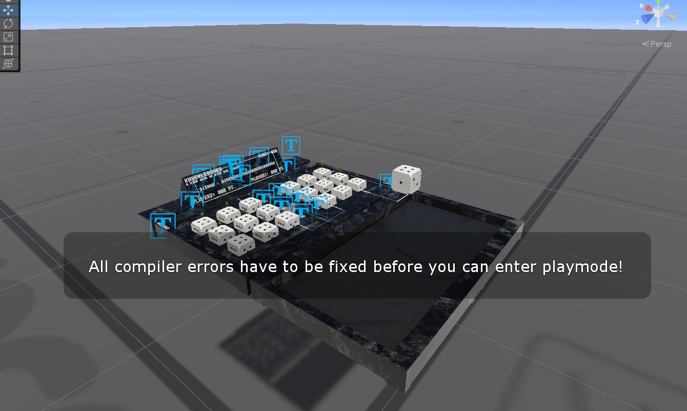

# Udon Knucklebones

 

VRChat で遊べる運と駆け引きのゲーム。

- 簡単操作のテーブルゲーム
- VCC (VRChat Creator Companion) 追加 & Prefab 追加で導入完了
- Player/CPU 対戦可能
- UdonChips あり版/なし版それぞれ対応
- サンプルシーン、ゲーム説明用のボード・画像を同梱

本家は [Cult of the Lamb](https://store.steampowered.com/app/1313140/Cult_of_the_Lamb/?l=japanese) 作中に登場するゲームで、本作品はファンメイドとなる。

## 外観

## 体験用ワールド

- UdonChips 対応版
  - <https://vrchat.com/home/launch?worldId=wrld_297a95c7-da3f-444f-93bf-f0b5e2fee692>
- UdonChips 非対応版
  - <https://vrchat.com/home/launch?worldId=wrld_1cfea318-1c43-4093-a077-38ca6bcf8491>

## 遊び方

- 交互にサイコロを振り、3 列のうち空いている列にサイコロを配置する
- 以下のルールに従いサイコロを取り除く
- どちらかがサイコロを置けなくなった時点でゲーム終了となり、得点の高いほうが勝利

## 導入

### 1. 前準備

以下 URL より、VCC に UdonKnucklebones を追加する。

<https://wipeseals.github.io/UdonKnucklebones/>

自分のワールドプロジェクトに VCC から UdonKnucklebones を追加。(Version はその時時の最新を推奨)

### 2.A. Prefab 追加 (UdonChips 非対応版)

`Packages/Udon Knucklebones/Runtime/Prefabs` に UdonKnucklebones の Prefab があるので、これをシーン中に追加する。

### 2.B. Prefab 追加 (UdonChips 対応版)

UdonChips 対応が不要な場合は Skip

#### 注意

2.B. は事前に UdonChips の導入を済ませ、Scene 中に UdonChips の Object がある前提の手順となる
UdonChips 未導入の場合は **実施してはいけない。** 実施してしまった場合、 `Assets/UdonKnucklebonesSupportUdonChips` の手動削除で対処可能。

#### 手順

`Packages/Udon Knucklebones/Runtime/UnityPackages` に UdonKnucklebones(UdonChips) 導入用の UnityPackage があるので、これをダブルクリックして導入。

以下ファイルが `Assets/UdonKnucklebonesSupportUdonChips` に追加されるので Import を押す。

`Assets/UdonKnucklebonesSupportUdonChips/Prefabs` に UdonChips 対応版の UdonKnucklebones の Prefab があるので、これを Scene に追加。

### 3. 設定

Prefab を配置するだけで動作するので特別設定作業はないが、以下の設定が可能。

| 設定名                  | 内容                                                                                                                                |
| ----------------------- | ----------------------------------------------------------------------------------------------------------------------------------- |
| Is Debug                | true の場合、Debug.Log で動作状況が出力されます                                                                                     |
| Udon Chips Player Rate  | UdonChips 対応版の Player 戦で、勝敗の点差に応じて移動する UdonChips のレート (例えば、100 に設定している場合、1 点差=100UdonChips) |
| Udon Chips Cpu Rate     | 上記レートの CPU 戦版                                                                                                               |
| Think Time For Cpu      | CPU の思考時間平均。キビキビ動作させたい場合は減らす                                                                                |
| Polling Sec For Rolling | サイコロを転がす際の監視間隔。通常は変更不要                                                                                        |
| Is Column Index Crossed | Player1 の列と Player2 の列の番号が交差している場合は true。通常は変更不要                                                          |
| Dice Roll Force Range   | サイコロを振るときの強さ最大値                                                                                                      |
| Dice Roll Timeout Sec   | サイコロの目を決定するときのタイムアウト                                                                                            |
| Dice Value For XXXX     | サイコロの面と目の同期用。通常は変更不要                                                                                            |

## トラブルシューティング他

### 動作確認を行いたい

Unity PlayMode でのデバッグ、及びワールド中でのデバッグが可能。
何かしらの問題が発生しておりアセットの不具合が疑われる場合は、クリーンな環境（アセット中の Script を手動で書き換えたりなどしていない状況）で同梱のサンプルシーンが正常動作することをご確認願います。

UdonChips 非対応サンプル

UdonChips 対応サンプル

内容は体験用ワールドそのものになります。

### コンパイルエラーになる

エラーの内容確認をお願いします。

もし UdonChips 対応不要なのに誤って導入してしまった場合、導入したが UdonChips が準備できていない場合、以下のような表示になります。

UdonChips の導入、もしくは UdonChips 対応版 UdonKnucklebones の削除対応が必要です。

### UdonChips が正常に動作しない

UdonChips 対応版を使用していることを確認願います。
UdonChips 自体はプロジェクト中にあるが、シーン中にない場合はコンソール中に以下のエラー表示があります。

### 音源の差し替え・音量調節を行いたい

Dice Roll Audio Clip/Source, Dice Put Audio Clip/Source からサイコロを振った時・置いたときの音関連の挙動が変更できます。

### UdonChips の掛け金を変更したい

Udon Chips Player Rate/Udon Chips Cpu Rate から変更可能です。

## 設計情報

- Manual 同期を用いており、各ターンの Player が Owner を持つ
- Player vs CPU、CPU vs CPU の場合は最終操作者が Owner を持つ
- 後から World に参加した Player 向けの同期処理も施しており、参加者自身の`OnPlayerJoined` で Owner 宛にデータの同期と UI 更新イベントの発生ンをリクエストする
- UdonChips 対応版は、本家 Script を継承し asmdef を明示していない (`Assembly-CSharp*` に属する)スクリプトとして定義される
- UdonChips 対応版はこの都合より `Assets/UdonKnucklebonesSupportUdonChips` に分ける必要があり、不要な環境でビルドエラーにならないように UnityPackage 同梱の形態を取っている
